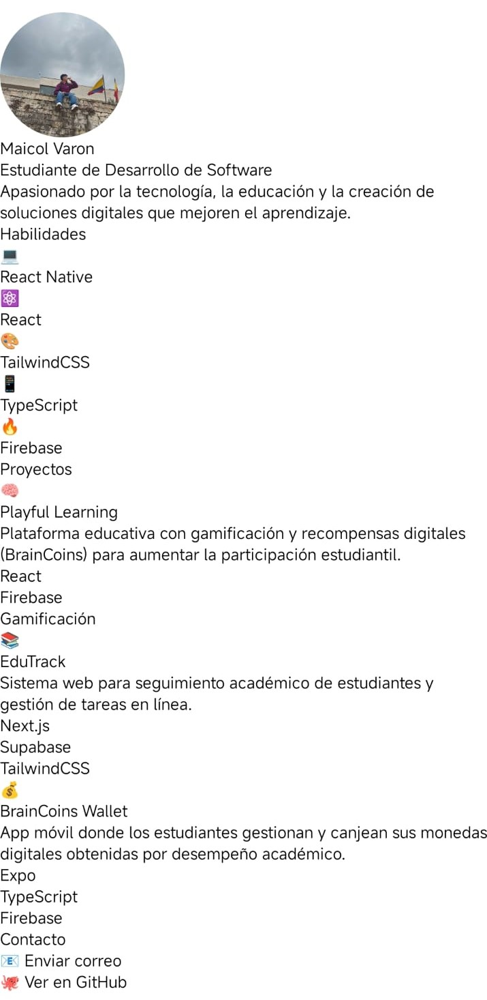

# reactnative-semana01-proyecto

## 🧭 Objetivo  
- Construir una interfaz sencilla, centrada en el usuario, con buen diseño y usabilidad.  
- Mostrar mis datos personales (nombre, rol, biografía) de forma atractiva.  
- Sentar las bases del portafolio móvil que evolucionaré con más secciones (habilidades, proyectos, contacto).  
- Aprender y aplicar buenas prácticas en configuración de rutas, imágenes, estilos y navegación en React Native.

## 🛠 Tecnologías utilizadas  
- **Lenguaje y Framework**: React Native + TypeScript  
- **Entorno**: Expo (para desarrollo ágil en dispositivos móviles)  
- **Estructura**: Carpetas `/assets` (imágenes), `/components` (componentes reutilizables)  
- **Estilos**: Estilos inline y a través de `StyleSheet`  
- **Herramientas de desarrollo**: Metro Bundler, caché limpia (`expo start -c`), sistema de imágenes locales y remotas.

## 📁 Estructura del proyecto  

mi-app-personal/
├── assets/ ← Imágenes y medios
│ └── Perfil.jpg ← Imagen de perfil
├── components/ ← Componentes reutilizables
│ └── ProfileSection.tsx
├── App.tsx ← Punto de entrada de la aplicación
├── babel.config.js ← Configuración de Babel
└── package.json ← Dependencias y scripts

> Nota: Esta estructura garantiza claridad y escalabilidad, permitiendo añadir nuevas secciones fácilmente.

## 🚀 Instalación y ejecución  
1. Clona el repositorio  
   ```bash
   git clone https://github.com/varonmaicol/reactnative-semana01-proyecto.git

   cd reactnative-semana01-proyecto/mi-app-personal

   npm install

   npx expo start -c

   Capturas de pantalla

(Aquí puedes insertar imágenes de tu app en funcionamiento, por ejemplo: pantalla de perfil, imagen de usuario, sección “Acerca de mí”)
Puedes usar Markdown así para mostrarlas:




   Dependencias principales

Ejecuta esto en la raíz del proyecto (donde está tu package.json):

npm install react react-native expo


Estas tres son la base:

react → la librería principal.

react-native → para desarrollar interfaces móviles.

expo → entorno que facilita la configuración, ejecución y compilación del proyecto.

🧩 Dependencias de desarrollo (para Babel y TypeScript)

Estas aseguran que el proyecto compile correctamente y puedas usar JSX/TSX:

npm install --save-dev @babel/core babel-preset-expo typescript


También instala los tipos de React para TypeScript:

npm install --save-dev @types/react @types/react-native

🎨 Librerías opcionales útiles

Estas no son obligatorias, pero mejoran mucho la experiencia y la estructura del proyecto:

npm install nativewind
npm install react-native-svg
npm install react-native-safe-area-context
npm install react-native-screens

👉 Si usas Tailwind con React Native (a través de NativeWind):

Instala:

npm install nativewind
npm install react-native-svg


Crea el archivo tailwind.config.js:

/** @type {import('tailwindcss').Config} */
module.exports = {
  content: ["./App.{js,jsx,ts,tsx}", "./components/**/*.{js,jsx,ts,tsx}"],
  theme: {
    extend: {},
  },
  plugins: [],
};


Asegúrate de tener el import en App.tsx:

import "nativewind/tailwind.css";

🧱 Resumen general
Tipo	Paquete	Descripción
Base	expo	Entorno de ejecución y compilación
Base	react, react-native	Núcleo de la app
Compilación	@babel/core, babel-preset-expo	Para transformar el código
Tipado	typescript, @types/react, @types/react-native	Tipos para TS
Estilos	nativewind	Tailwind en React Native
Utilidades	react-native-svg, react-native-screens, react-native-safe-area-context	Mejor compatibilidad visual

👨‍💻 Autor

Maicol Varón
Estudiante de Desarrollo de Software
LinkedIn
 | GitHub

📫 Contacto

¿Tienes una sugerencia o quieres colaborar?
Envíame un correo a: maicol.varon@example.com

¡Estoy abierto a nuevas ideas y proyectos!

📜 Licencia

Este proyecto es de uso personal y se distribuye bajo los términos de uso que decida el autor.
Si deseas reutilizar cualquier parte, por favor menciona la autoría.

